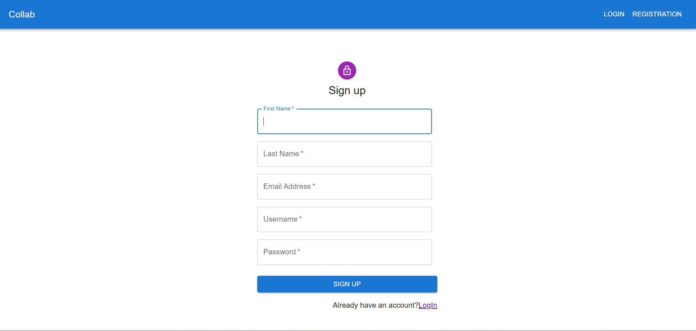
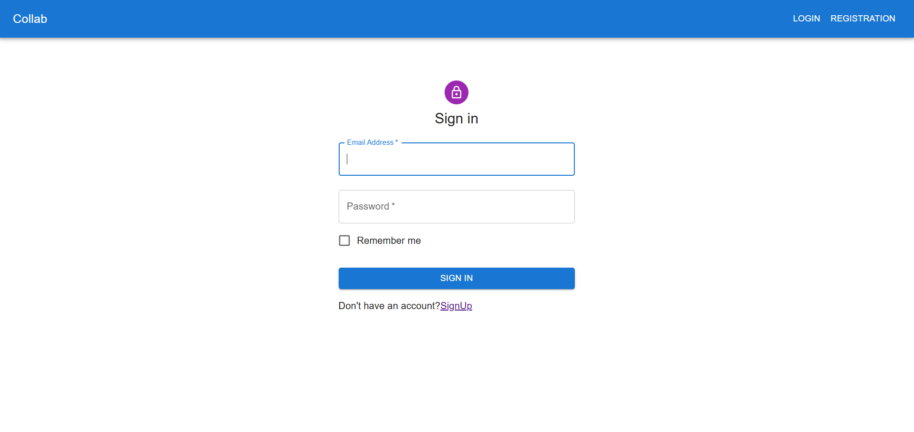
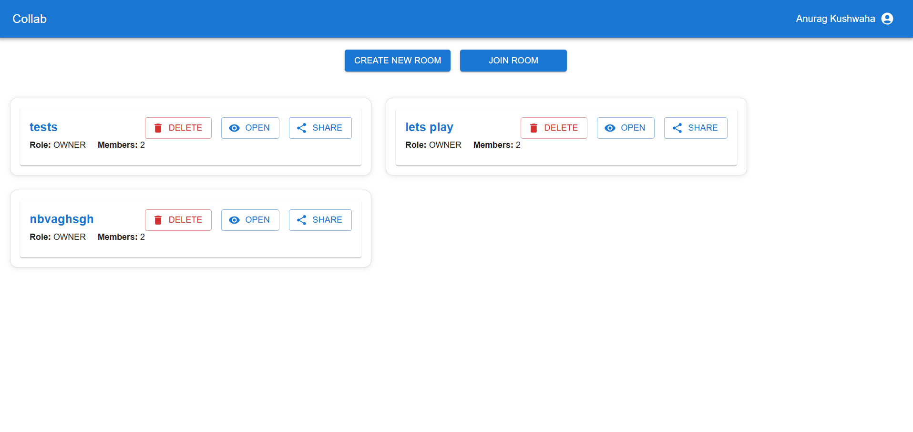
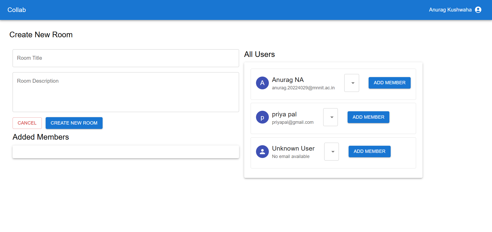
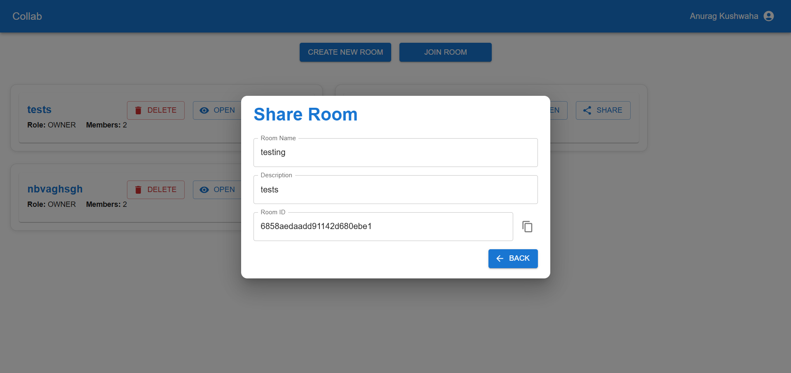
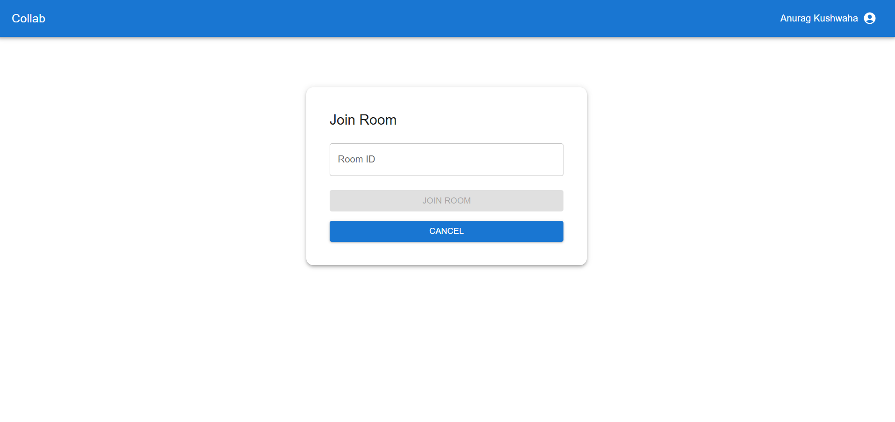
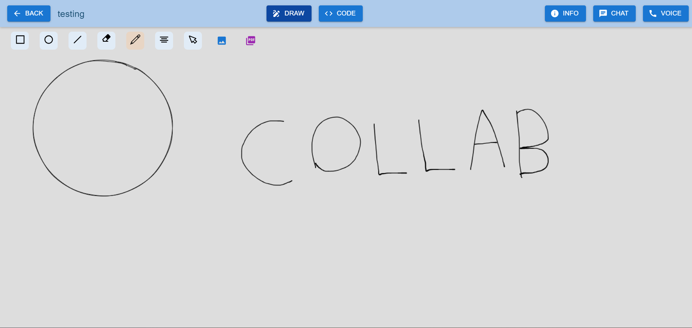
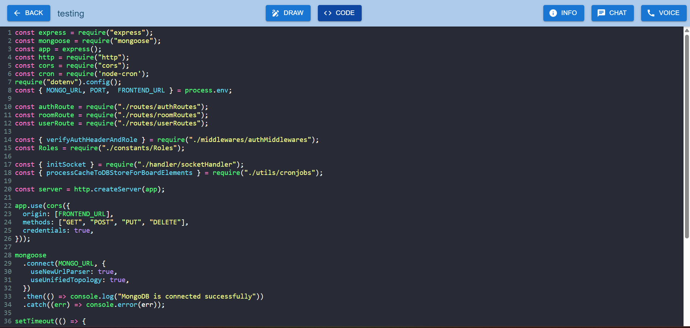
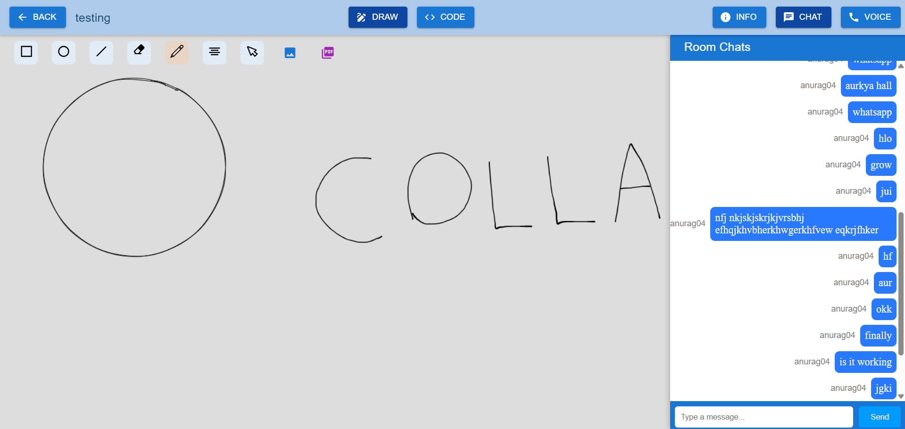
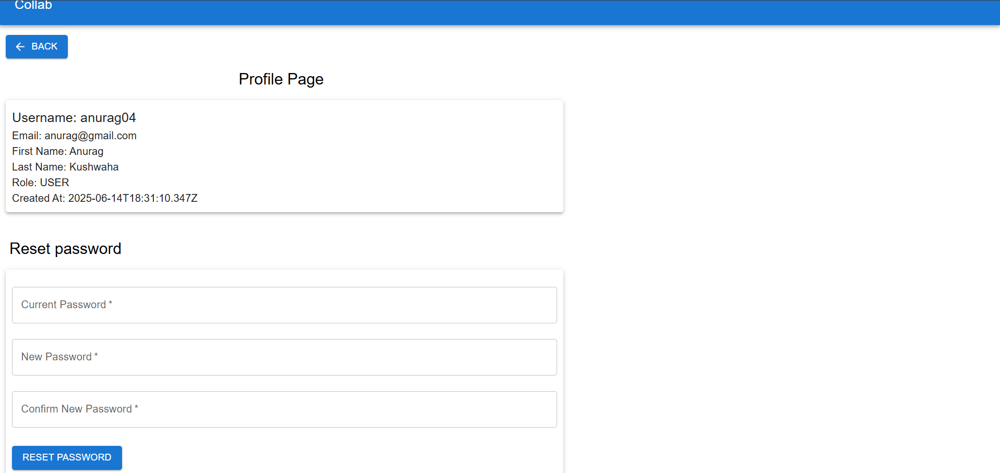

#  Collab

**Collab** is a real-time collaborative web application that brings together a **code editor**, **whiteboard**, and **chatroom** — all inside a multi-user room environment. It’s designed to enhance collaborative coding, brainstorming, and teaching sessions with smooth real-time interactions.

---

## 🚀 Live Demo

You can try out a live version of the application here:

[**Try Collab Live!**](https://dapper-lamingt.netlify.app/)

---

## 🚀 Features

- 🧑‍💻 **Real-Time Code Editor**
  - Live code editing between all participants in a room
  - Supports syntax highlighting and formatting

- 🧑‍🎨 **Collaborative Whiteboard**
  - Drawing tools, text input, eraser, shape movement
  - Export board as **JPG** or **PDF**

- 💬 **Integrated Chatroom**
  - Instant messaging between room members
  - Scrollable, styled interface

- 👥 **Multi-User Room Support**
  - Each room supports multiple participants simultaneously
  - State sync using **Socket.IO**

---

## 📸 Screenshot

---

## 🧱 Tech Stack

| Layer                     | Technology                            |
|---------------------------|---------------------------------------|
| Frontend                  | React.js,JavaScript, MUI              |
| Backend                   | Node.js, Express                      |
| WhiteBoard                | Canvas                                |
| CodeEditor                | CodeMirror                            |
| Real-Time Communication   | Socket.IO                             |

## 🚀 Getting Started

### 1. Clone the repository
<pre>
git clone https://github.com/anuragk-04/Collab.git
cd Collab </pre>

### 2. Start Frontend
<pre>
cd frontend
npm install
npm run dev
</pre>

### 3. Start Backend
<pre>
cd server
npm install
npm start 
 </pre>

## 🚈 Future Improvements

- [ ] Add Voice Chatting for better communucation
- [ ] Allow file uploads inside rooms

## 👤 Author

**Anurag Kushwaha** 
📫 [LinkedIn](https://www.linkedin.com/in/anuragk04/)  
🐙 [GitHub](https://github.com/anuragk-04)  
